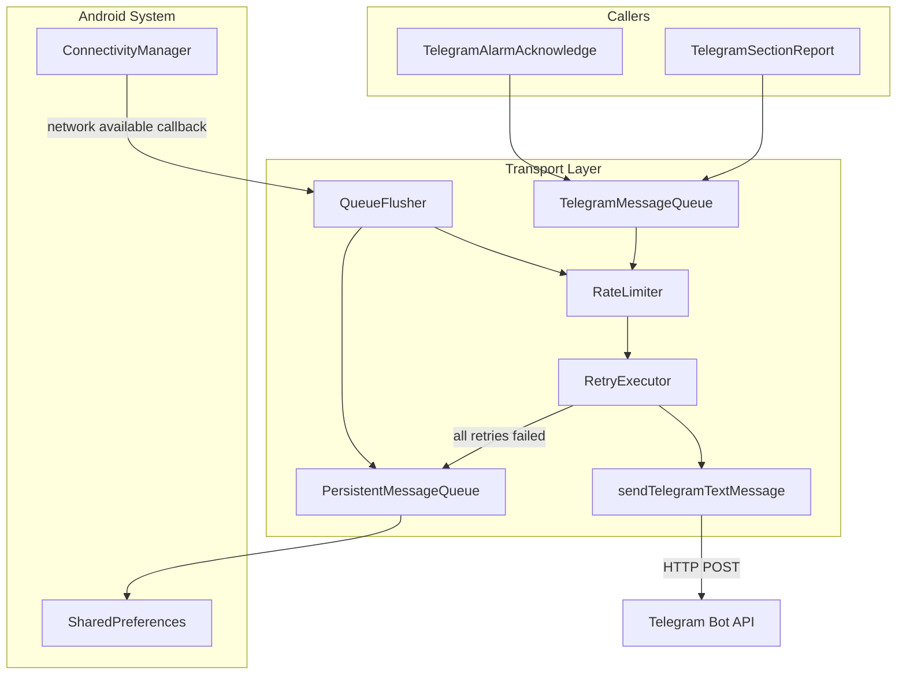
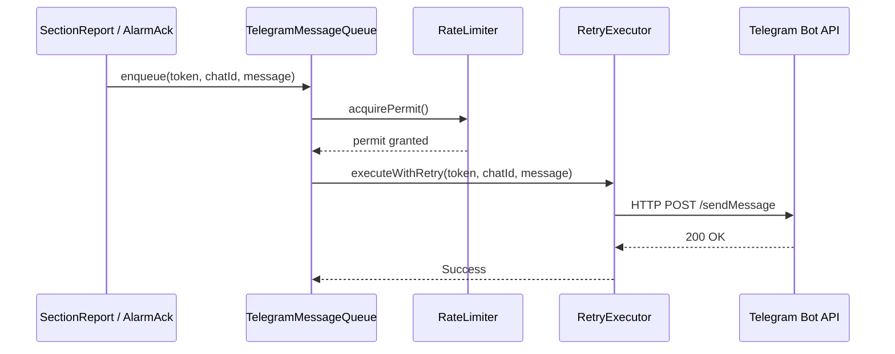
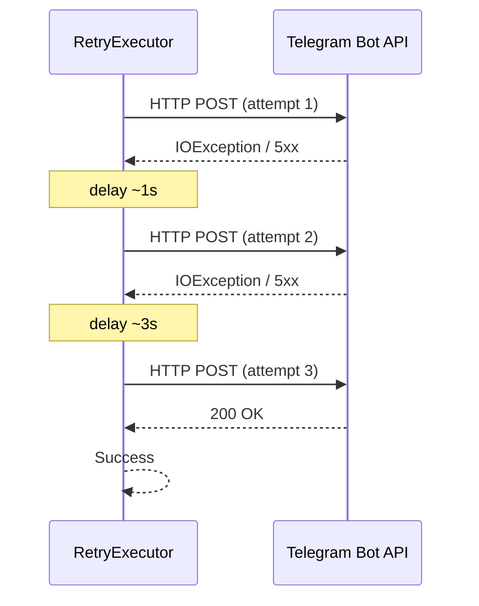
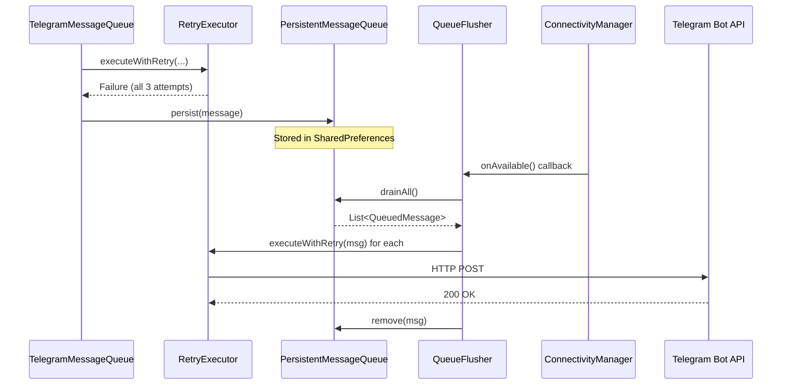

# Design Document: Telegram Retry + Offline Queue

## Overview

This feature adds resilient message delivery to the EXAM LOCK app's Telegram transport layer. Currently, `sendTelegramTextMessage()` performs a single HTTP POST with no retry logic — if the network flaps during an alarm send, the report is permanently lost.

The solution introduces three cooperating components: a **RetryExecutor** that wraps individual HTTP calls with exponential backoff, a **PersistentMessageQueue** backed by SharedPreferences that survives app restarts, and a **QueueFlusher** that drains queued messages when connectivity returns. A token-bucket **RateLimiter** ensures the app never exceeds Telegram's API rate limits (max 5 messages per 10 seconds).

All operations run on `Dispatchers.IO` via coroutines, keeping the main thread free. The design avoids heavy dependencies (no Room, no WorkManager) to stay within the low-RAM device constraint.

## Architecture



## Sequence Diagrams

### Happy Path: Immediate Delivery



### Retry Path: Transient Failure then Success



### Offline Path: Queue and Flush Later



## Components and Interfaces

### Component 1: TelegramMessageQueue

**Purpose**: Single entry point for all Telegram sends. Coordinates rate limiting, retry, and offline queueing.

```kotlin
internal class TelegramMessageQueue(
    private val context: Context,
    private val retryExecutor: RetryExecutor = RetryExecutor(),
    private val rateLimiter: RateLimiter = RateLimiter(maxTokens = 5, refillPeriodMs = 10_000L),
    private val persistentQueue: PersistentMessageQueue = PersistentMessageQueue(context),
    private val scope: CoroutineScope = CoroutineScope(Dispatchers.IO + SupervisorJob())
) {
    suspend fun send(token: String, chatId: String, message: String): Result<Unit>
    fun sendAsync(token: String, chatId: String, message: String): Job
    fun startNetworkListener()
    fun shutdown()
}
```

**Responsibilities**:
- Accept messages from callers without blocking
- Enforce rate limiting before attempting delivery
- Delegate to RetryExecutor for actual HTTP calls
- Persist failed messages to PersistentMessageQueue
- Listen for network restoration and flush queue

### Component 2: RetryExecutor

**Purpose**: Wraps a single HTTP send with exponential backoff retry logic.

```kotlin
internal class RetryExecutor(
    private val maxAttempts: Int = 3,
    private val baseDelayMs: Long = 1_000L,
    private val multiplier: Double = 3.0,
    private val jitterFraction: Double = 0.2
) {
    suspend fun execute(
        token: String,
        chatId: String,
        message: String
    ): Result<Unit>
}
```

**Responsibilities**:
- Attempt HTTP POST up to `maxAttempts` times
- Apply exponential backoff with jitter between attempts
- Distinguish retryable errors (IOException, HTTP 5xx, 429) from permanent failures (4xx except 429)
- Return success or final failure result

### Component 3: RateLimiter

**Purpose**: Token-bucket rate limiter ensuring max 5 messages per 10-second window.

```kotlin
internal class RateLimiter(
    private val maxTokens: Int = 5,
    private val refillPeriodMs: Long = 10_000L
) {
    suspend fun acquire()
    fun tryAcquire(): Boolean
}
```

**Responsibilities**:
- Track available send tokens
- Suspend callers when tokens are exhausted until refill
- Thread-safe via Mutex

### Component 4: PersistentMessageQueue

**Purpose**: Disk-backed FIFO queue using SharedPreferences. Survives app restarts.

```kotlin
internal class PersistentMessageQueue(
    context: Context,
    private val maxSize: Int = 50,
    private val prefsName: String = "telegram_offline_queue"
) {
    fun enqueue(entry: QueuedMessage)
    fun peek(count: Int): List<QueuedMessage>
    fun remove(id: String)
    fun removeAll(ids: List<String>)
    fun size(): Int
    fun clear()
}
```

**Responsibilities**:
- Serialize/deserialize messages to JSON in SharedPreferences
- Enforce max queue size (drop oldest when full)
- Provide atomic read-then-remove operations
- Minimize disk I/O (batch writes via `apply()`)

### Component 5: QueueFlusher

**Purpose**: Monitors network connectivity and drains the persistent queue when connection is restored.

```kotlin
internal class QueueFlusher(
    private val context: Context,
    private val queue: PersistentMessageQueue,
    private val retryExecutor: RetryExecutor,
    private val rateLimiter: RateLimiter,
    private val scope: CoroutineScope
) {
    fun register()
    fun unregister()
}
```

**Responsibilities**:
- Register `ConnectivityManager.NetworkCallback` for network availability
- On network available: drain queue respecting rate limits
- Skip flush if queue is empty
- Handle partial flush failures (re-queue or leave in place)

## Data Models

### QueuedMessage

```kotlin
internal data class QueuedMessage(
    val id: String,           // UUID for dedup
    val token: String,        // Bot token (already decoded)
    val chatId: String,       // Target chat
    val message: String,      // Message text (single chunk)
    val enqueuedAt: Long,     // SystemClock.elapsedRealtime() or System.currentTimeMillis()
    val attemptCount: Int = 0 // Number of flush attempts so far
)
```

**Validation Rules**:
- `id` must be non-blank UUID string
- `token` and `chatId` must be non-blank
- `message` must be non-empty and ≤ `TelegramMessageChunkLimit` (3400 chars)
- `enqueuedAt` must be > 0
- `attemptCount` must be ≥ 0

### RetryPolicy

```kotlin
internal data class RetryPolicy(
    val maxAttempts: Int = 3,
    val baseDelayMs: Long = 1_000L,
    val multiplier: Double = 3.0,
    val jitterFraction: Double = 0.2
)
```

**Computed delays**: attempt 1 → ~1s, attempt 2 → ~3s, attempt 3 → ~9s (with ±20% jitter)

## Algorithmic Pseudocode

### Main Send Algorithm

```kotlin
// TelegramMessageQueue.send()
suspend fun send(token: String, chatId: String, message: String): Result<Unit> {
    // Step 1: Acquire rate limit permit (suspends if exhausted)
    rateLimiter.acquire()

    // Step 2: Attempt delivery with retry
    val result = retryExecutor.execute(token, chatId, message)

    // Step 3: On failure, persist to offline queue
    if (result.isFailure) {
        val entry = QueuedMessage(
            id = UUID.randomUUID().toString(),
            token = token,
            chatId = chatId,
            message = message,
            enqueuedAt = System.currentTimeMillis()
        )
        persistentQueue.enqueue(entry)
    }

    return result
}
```

### Retry with Exponential Backoff Algorithm

```kotlin
// RetryExecutor.execute()
suspend fun execute(token: String, chatId: String, message: String): Result<Unit> {
    var lastException: Throwable? = null

    for (attempt in 1..maxAttempts) {
        try {
            sendTelegramTextMessage(token, chatId, message)
            return Result.success(Unit)
        } catch (e: Exception) {
            lastException = e

            // Don't retry on permanent client errors (4xx except 429)
            if (isPermanentFailure(e)) {
                return Result.failure(e)
            }

            // Don't delay after the last attempt
            if (attempt < maxAttempts) {
                val baseDelay = (baseDelayMs * multiplier.pow(attempt - 1)).toLong()
                val jitter = (baseDelay * jitterFraction * Random.nextDouble(-1.0, 1.0)).toLong()
                delay(baseDelay + jitter)
            }
        }
    }

    return Result.failure(lastException ?: IOException("All retry attempts exhausted"))
}

private fun isPermanentFailure(e: Exception): Boolean {
    // HTTP 4xx (except 429 Too Many Requests) are permanent
    if (e is TelegramHttpException) {
        return e.statusCode in 400..499 && e.statusCode != 429
    }
    // IOExceptions and 5xx are transient → retry
    return false
}
```

### Queue Flush Algorithm

```kotlin
// QueueFlusher — triggered by ConnectivityManager.NetworkCallback.onAvailable()
private suspend fun flushQueue() {
    val pending = queue.peek(count = queue.size())
    if (pending.isEmpty()) return

    for (entry in pending) {
        rateLimiter.acquire()

        val result = retryExecutor.execute(entry.token, entry.chatId, entry.message)
        if (result.isSuccess) {
            queue.remove(entry.id)
        } else {
            // Stop flushing on failure — network may have dropped again
            break
        }
    }
}
```

### Token-Bucket Rate Limiter Algorithm

```kotlin
// RateLimiter.acquire()
private val mutex = Mutex()
private var tokens = maxTokens
private var lastRefillTime = SystemClock.elapsedRealtime()

suspend fun acquire() {
    while (true) {
        mutex.withLock {
            refillTokens()
            if (tokens > 0) {
                tokens--
                return
            }
        }
        // Wait until next refill window
        delay(refillPeriodMs / maxTokens)
    }
}

private fun refillTokens() {
    val now = SystemClock.elapsedRealtime()
    val elapsed = now - lastRefillTime
    if (elapsed >= refillPeriodMs) {
        tokens = maxTokens
        lastRefillTime = now
    }
}
```

### Persistent Queue Serialization

```kotlin
// PersistentMessageQueue.enqueue()
fun enqueue(entry: QueuedMessage) {
    synchronized(lock) {
        val entries = loadEntries().toMutableList()

        // Drop oldest if at capacity
        while (entries.size >= maxSize) {
            entries.removeAt(0)
        }

        entries.add(entry)
        saveEntries(entries)
    }
}

private fun loadEntries(): List<QueuedMessage> {
    val json = prefs.getString(KEY_QUEUE, null) ?: return emptyList()
    return deserializeQueue(json)
}

private fun saveEntries(entries: List<QueuedMessage>) {
    val json = serializeQueue(entries)
    prefs.edit().putString(KEY_QUEUE, json).apply()
}
```

## Key Functions with Formal Specifications

### Function: RetryExecutor.execute()

```kotlin
suspend fun execute(token: String, chatId: String, message: String): Result<Unit>
```

**Preconditions:**
- `token` is non-blank and valid Telegram bot token format
- `chatId` is non-blank
- `message` is non-empty and ≤ 3400 characters
- Coroutine is running on `Dispatchers.IO`

**Postconditions:**
- Returns `Result.success(Unit)` if any attempt within `maxAttempts` succeeds (HTTP 2xx)
- Returns `Result.failure(e)` if all attempts fail or a permanent error is encountered
- Total wall-clock time ≤ `baseDelayMs * (multiplier^(maxAttempts-1)) * 2 + connectTimeout * maxAttempts` (~31s worst case)
- No side effects beyond the HTTP calls themselves

**Loop Invariants:**
- `attempt` ∈ [1, maxAttempts]
- If loop continues, previous attempt resulted in a retryable error
- Delay between attempts grows exponentially: `baseDelayMs * multiplier^(attempt-1) ± jitter`

### Function: PersistentMessageQueue.enqueue()

```kotlin
fun enqueue(entry: QueuedMessage)
```

**Preconditions:**
- `entry.id` is unique UUID string
- `entry.message.length` ≤ 3400
- SharedPreferences file is accessible

**Postconditions:**
- `size()` ≤ `maxSize` (50)
- If queue was at capacity, oldest entry is removed before insertion
- New entry is at the tail of the queue (FIFO order preserved)
- Data is persisted to disk (survives process death)

**Loop Invariants:**
- While `entries.size >= maxSize`: each iteration removes exactly one entry from index 0

### Function: RateLimiter.acquire()

```kotlin
suspend fun acquire()
```

**Preconditions:**
- Called from a coroutine context (suspendable)

**Postconditions:**
- Returns only when a token has been consumed
- `tokens` decremented by exactly 1
- At most `maxTokens` (5) calls can return within any `refillPeriodMs` (10s) window
- Does not starve: tokens refill every `refillPeriodMs`

**Loop Invariants:**
- `tokens` ∈ [0, maxTokens]
- `lastRefillTime` ≤ `SystemClock.elapsedRealtime()`

### Function: QueueFlusher.flushQueue()

```kotlin
private suspend fun flushQueue()
```

**Preconditions:**
- Network connectivity has been restored (onAvailable callback fired)
- `queue` and `retryExecutor` are initialized

**Postconditions:**
- All successfully sent messages are removed from the persistent queue
- On first send failure, flush stops (preserves remaining messages for next attempt)
- Rate limiting is respected for each message sent
- Queue order is preserved (FIFO delivery)

## Example Usage

```kotlin
// Initialization (in Application or Service)
val telegramQueue = TelegramMessageQueue(context)
telegramQueue.startNetworkListener()

// Sending from TelegramSectionReport (replaces direct sendTelegramTextMessage calls)
buildTelegramMessageChunks(message).forEach { chunk ->
    telegramQueue.sendAsync(
        token = token,
        chatId = chatId,
        message = chunk
    )
}

// Sending from TelegramAlarmAcknowledge
buildTelegramMessageChunks(message).forEach { chunk ->
    val result = telegramQueue.send(
        token = token,
        chatId = chatId,
        message = chunk
    )
    // Result indicates immediate delivery success/failure
    // On failure, message is already queued for later delivery
}

// Cleanup (when exam session ends)
telegramQueue.shutdown()
```

## Correctness Properties

1. **No message loss**: ∀ message m submitted via `send()` or `sendAsync()`, either m is delivered to Telegram API with HTTP 2xx, OR m exists in the persistent queue.

2. **Bounded retries**: ∀ send attempt, at most `maxAttempts` (3) HTTP requests are made before queueing.

3. **Rate limit compliance**: In any sliding 10-second window, at most 5 HTTP POST requests are made to the Telegram API.

4. **Queue bounded**: `persistentQueue.size()` ≤ `maxSize` (50) at all times.

5. **FIFO ordering**: Messages are flushed from the queue in the same order they were enqueued.

6. **Persistence**: If the app process is killed after `enqueue()` returns, the message is recoverable after restart.

7. **Non-blocking**: No operation in this system blocks the Android main thread.

8. **Idempotency safety**: Duplicate delivery is acceptable (Telegram handles duplicate messages gracefully); no message is silently dropped.

## Error Handling

### Error Scenario 1: Network Timeout / IOException

**Condition**: HTTP connection times out or socket error during POST
**Response**: RetryExecutor catches exception, waits with exponential backoff, retries up to 3 times
**Recovery**: If all retries fail, message is persisted to offline queue for later delivery

### Error Scenario 2: Telegram Rate Limit (HTTP 429)

**Condition**: Telegram API returns 429 Too Many Requests
**Response**: Treated as retryable error. RetryExecutor backs off and retries. RateLimiter prevents this from recurring frequently.
**Recovery**: Backoff delay allows Telegram's rate limit window to pass

### Error Scenario 3: Permanent Client Error (HTTP 400/401/403)

**Condition**: Invalid token, invalid chat ID, or malformed request
**Response**: RetryExecutor does NOT retry (permanent failure). Returns failure immediately.
**Recovery**: Message is still queued (token/chatId might be fixed on next app restart with updated config)

### Error Scenario 4: SharedPreferences Write Failure

**Condition**: Disk full or SharedPreferences corrupted
**Response**: `enqueue()` catches exception, logs error. Message is lost in this edge case.
**Recovery**: Queue continues to function for subsequent messages. Extremely rare on Android.

### Error Scenario 5: Queue Full (50 messages)

**Condition**: Persistent queue already contains 50 messages when a new one arrives
**Response**: Oldest message is dropped to make room for the new message
**Recovery**: Automatic — newest messages are always preserved (more relevant for ongoing exam)

### Error Scenario 6: Network Flaps During Flush

**Condition**: Network drops again while QueueFlusher is draining messages
**Response**: Flush loop breaks on first failure. Successfully sent messages are removed; remaining stay in queue.
**Recovery**: Next `onAvailable()` callback triggers another flush attempt

## Testing Strategy

### Unit Testing Approach

- **RetryExecutor**: Mock `sendTelegramTextMessage` to simulate failures/successes. Verify retry count, delay timing, and permanent-failure short-circuit.
- **RateLimiter**: Verify that >5 rapid `acquire()` calls result in suspension. Verify token refill after period.
- **PersistentMessageQueue**: Use Robolectric SharedPreferences. Test enqueue/dequeue, max size enforcement, FIFO order, serialization round-trip.
- **TelegramMessageQueue**: Integration of all components. Mock network state and HTTP layer.

### Property-Based Testing Approach

**Property Test Library**: Not applicable (no fast-check equivalent in standard Android test stack). Use parameterized JUnit tests with randomized inputs.

- Property: Queue size never exceeds 50 regardless of enqueue pattern
- Property: Retry delay grows monotonically (ignoring jitter)
- Property: Rate limiter never allows >5 permits in any 10s window
- Property: Serialization round-trip preserves all QueuedMessage fields

### Integration Testing Approach

- Use MockWebServer (OkHttp) to simulate Telegram API responses
- Test full flow: send → retry → queue → network restore → flush → delivery
- Test with real SharedPreferences on device via instrumented tests

## Performance Considerations

- **Memory**: QueuedMessage objects are small (~4KB max per message). 50 messages ≈ 200KB in SharedPreferences — negligible.
- **Disk I/O**: SharedPreferences `apply()` is async. No ANR risk. Batch operations minimize writes.
- **CPU**: Exponential backoff uses `delay()` (coroutine suspension, not thread sleep). No CPU burn during waits.
- **Battery**: NetworkCallback is passive (no polling). Flush only triggers on actual connectivity events.
- **Thread usage**: All work on `Dispatchers.IO` thread pool. No dedicated threads created.

## Security Considerations

- **Token handling**: Bot token is passed through from `SecureStrings` — never persisted in plaintext in the queue. The queue stores the already-decoded token in memory only during flush; on disk it's stored as-is since SharedPreferences is app-private storage.
- **Message content**: Diagnostic messages may contain device info. SharedPreferences is sandboxed to the app's private directory — inaccessible to other apps without root.
- **No new permissions**: Uses existing `ACCESS_NETWORK_STATE` permission already declared for `ConnectivityManager`.

## Dependencies

- `kotlinx.coroutines` (already in project) — for `delay()`, `Mutex`, `CoroutineScope`, `Dispatchers.IO`
- `android.net.ConnectivityManager` (system API) — for `NetworkCallback`
- `android.content.SharedPreferences` (system API) — for queue persistence
- `org.json` (Android built-in) — for queue serialization (no external JSON library needed)
- No new third-party dependencies added
